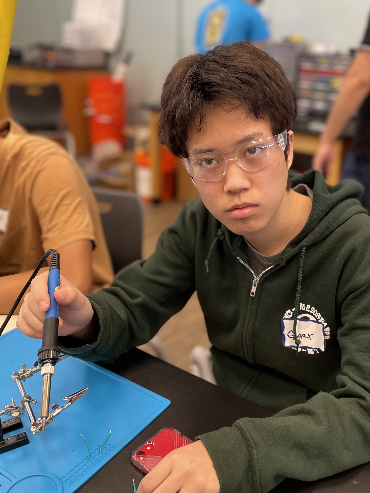

Hexapod Project: This hexapod project is meant to be a robot that has 6 legs. Each of the legs provides the robot with additional stability that allows it to move even if one or two of the arms are then impaired.

<!--You should comment out all portions of your portfolio that you have not completed yet, as well as any instructions:-->

<!--- This is an HTML comment in Markdown -->
<!--- Anything between these symbols will not render on the published site -->


| **Engineer** | **School** | **Area of Interest** | **Grade** |
|:--:|:--:|:--:|:--:|
| Gary P | Lynbrook High School | Electrical Engineering | Incoming Senior

<!--**Replace the BlueStamp logo below with an image of yourself and your completed project. Follow the guide [here](https://tomcam.github.io/least-github-pages/adding-images-github-pages-site.html) if you need help.**-->


  

<iframe width="560" height="315" src="https://www.youtube.com/embed/q5V6qldNWnI?si=LKr1N4cGkw76rhuB" title="YouTube video player" frameborder="0" allow="accelerometer; autoplay; clipboard-write; encrypted-media; gyroscope; picture-in-picture; web-share" referrerpolicy="strict-origin-when-cross-origin" allowfullscreen></iframe>

So for my third milestone, I really wanted to have the robot be connected and controlled through the given remote controller. I already had previously assembled my controller at the beginning of the project before milestone one, but I now needed to get it connected and actively working. So some issues that I faced with this project was because of the source code and also the battery being low on voltage. To solve these issues I looked through the source code and changed the part of the code that was causing a compliation error and then swapped out the battery for a new one and then the remote worked. So going forward into my project I really want to focus on modifying my project and adding cool features that would involve both soldering and coding aspects to incorporate everything that I have learned so far.


# Second Milestone

<iframe width="560" height="315" src="https://www.youtube.com/embed/d6G2hYmM8xY?si=ecsH_VolZqqW1W6r" title="YouTube video player" frameborder="0" allow="accelerometer; autoplay; clipboard-write; encrypted-media; gyroscope; picture-in-picture; web-share" referrerpolicy="strict-origin-when-cross-origin" allowfullscreen></iframe>

For my second milestone, I've worked on calibrating all the different servos that were required for each of the legs. Because on my last milestone, I was able to assemble the entirety of my robot and test if the servos worked, this milestone I chose to focus on making my legs and servos work. For the entire milestome, I closely followed the given A4 piece of paper that told me what to calibrate and how to calibrate the legs with the included software and code. Throughout the entire process I encountered some difficulties such as putting leg 4 in the correct servo, and this was a major issue I faced because there were so many different positions that the two servos of the leg could make and I had to observe how previous servos were oriented to correctly position in the correct position. For my next milestone, I want to allow my project work with the given remote that I had to build and ultimately allow the Hexapod work wirelessly. After my final milestone, I'll begin with my modifications.

# First Milestone

<iframe width="560" height="315" src="https://www.youtube.com/embed/5xF9r7mTrMs?si=0FoxfGDbo7Mm_ibe" title="YouTube video player" frameborder="0" allow="accelerometer; autoplay; clipboard-write; encrypted-media; gyroscope; picture-in-picture; web-share" referrerpolicy="strict-origin-when-cross-origin" allowfullscreen></iframe>

For my first milestone, I've assembled everything that I needed to assemble, but I have not yet tested the servos. For the entire project I just followed the tutorial that was supplied by the manufacturer and assembled the entire thing. The first milestone was just to assemble the entire hexapod and to see if the actual servos would work. 

# Challenges
I had difficulties with different types the motors not working and not always in the correct orientation and also being in the wrong connection, which will cause future issues. There were also some issues that I had that I couldn't put additional items on and screw it because of the wrong oritentiation. 
<!--# Schematics 
Here's where you'll put images of your schematics. [Tinkercad](https://www.tinkercad.com/blog/official-guide-to-tinkercad-circuits) and [Fritzing](https://fritzing.org/learning/) are both great resoruces to create professional schematic diagrams, though BSE recommends Tinkercad becuase it can be done easily and for free in the browser. 

# Code
Here's where you'll put your code. The syntax below places it into a block of code. Follow the guide [here]([url](https://www.markdownguide.org/extended-syntax/)) to learn how to customize it to your project needs. 
-->
```c++
void setup() {
  // put your setup code here, to run once:
  Serial.begin(9600);
  Serial.println("Hello World!");
}

void loop() {
  // put your main code here, to run repeatedly:

}
```

# Bill of Materials
Here's where you'll list the parts in your project. To add more rows, just copy and paste the example rows below.
Don't forget to place the link of where to buy each component inside the quotation marks in the corresponding row after href =. Follow the guide [here]([url](https://www.markdownguide.org/extended-syntax/)) to learn how to customize this to your project needs. 

| **Part** | **Note** | **Price** | **Link** |
|:--:|:--:|:--:|:--:|
| Freenove Hexapod| Building my project | $126.95 | <a href="https://www.amazon.com/Freenove-Raspberry-Crawling-Detailed-Tutorial/dp/B07FLVZ2DN"> Link </a> |
<!--
| Item Name | What the item is used for | $Price | <a href="https://www.amazon.com/Arduino-A000066-ARDUINO-UNO-R3/dp/B008GRTSV6/"> Link </a> |
| Item Name | What the item is used for | $Price | <a href="https://www.amazon.com/Arduino-A000066-ARDUINO-UNO-R3/dp/B008GRTSV6/"> Link </a> |
-->

<!--# Other Resources/Examples
One of the best parts about Github is that you can view how other people set up their own work. Here are some past BSE portfolios that are awesome examples. You can view how they set up their portfolio, and you can view their index.md files to understand how they implemented different portfolio components.
- [Example 1](https://trashytuber.github.io/YimingJiaBlueStamp/)
- [Example 2](https://sviatil0.github.io/Sviatoslav_BSE/)
- [Example 3](https://arneshkumar.github.io/arneshbluestamp/)

To watch the BSE tutorial on how to create a portfolio, click here.-->

# Arduino Starter Project
<iframe width="560" height="315" src="https://www.youtube.com/embed/GD7zZySB-bE?si=as-dP7jOMFZSjazG" title="YouTube video player" frameborder="0" allow="accelerometer; autoplay; clipboard-write; encrypted-media; gyroscope; picture-in-picture; web-share" referrerpolicy="strict-origin-when-cross-origin" allowfullscreen></iframe>

My starter was the arduino starter project. It basically just took into inputs and then outputted an output. So for my starter project, I put my input as a button, and the output was a light. The input (button) was put on a breadboard, while a wire was connected near the button and plugged into the arduino to provide input for the machine. Resistors and other wires were also set up to set up a basic circus. I coded a basic input and output if statement that checked ifthe input was being inputted and if so then the output would be outputted and if not the output wouldn't be outputted. 
