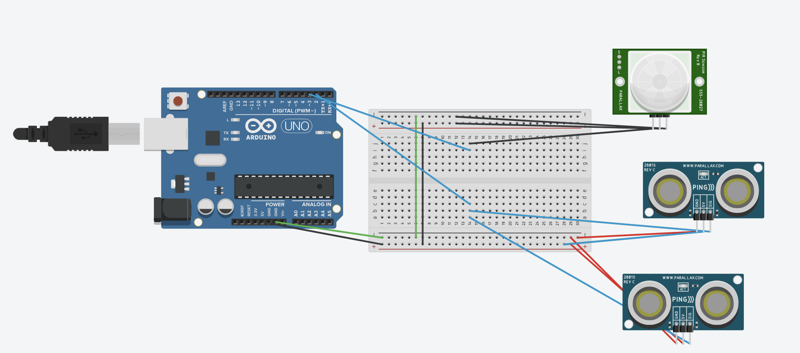

Hexapod Project: This hexapod project is a robot that has 6 legs. Each of the legs provides the robot with additional stability that allows it to move even if one or two of the arms are then impaired. It is able to move with a remote control and the 6 legs are driven by 18 different servo motors that control where the legs move, the legs' orientiations, and also the height of the leg.

<!--You should comment out all portions of your portfolio that you have not completed yet, as well as any instructions:-->

<!--- This is an HTML comment in Markdown -->
<!--- Anything between these symbols will not render on the published site -->


| **Engineer** | **School** | **Area of Interest** | **Grade** |
|:--:|:--:|:--:|:--:|
| Gary P | Lynbrook High School | Electrical Engineering | Incoming Senior

<!--**Replace the BlueStamp logo below with an image of yourself and your completed project. Follow the guide [here](https://tomcam.github.io/least-github-pages/adding-images-github-pages-site.html) if you need help.**-->


# Challenges Faced
For each of my milestones, I've faced key challenges that impeded and also hindered the process of my project. The most challenging of my challenges were for my modifications, I was unsure of my initial modification going out of my third milestone, but after a while I was suggested by Ben to use ultrasonic sensors after I told him of an idea that can track objects on my hexapod. The most difficult part of this project, was coding the project not only did I have to include two outside libraries and needed tremendous amount of help debugging my project. The project was really hard to code and also to debug because we had to accurately calculate the seconds that it took for the ultrasonic sensor to travel and to also come back and overall the library just didn't work super well with the code because it was being interferred by the ultrasonic sensor's interferrence, so at the end of the day we had to code the library in the code. I also had trouble with making the 3d print, because of the initial print failing I was really in a time crunch to build another 3d print. When the second 3d print came, the legs that would attach to the hexapod holes wouldn't attach, so I had to saw off two legs to make it fit. The PIR sensor also initially gave me issues, mainly because of how the initial robot code worked, I wasn't used to looking into the source code of the robot to figure out the different source methods and functions that were available for me and when I looked into the robot I had to learn a lot of the methods and how each of the C++ classes worked with each other to make the robot moving through a remote, and with this experience I was able to use my PIR sensor to change the height of the robot when it detected something.

For my third milestone, getting the remote control to connect with the robot was the biggest issue, this is because I attached the wifi and the bluetooth chip backwards and this caused the robot to not work properly, but I was able to fix it.

For my second milestone, getting the servos working was not the key issue for me, I faced issue with a faulty servo as it kept jittering and wasn't able to be locked into place, I was able to fix this issue by replacing it with a spare servo that was provided to me throughout the box. But because I had attached the servo in the wrong place, I spent a lot of time trying to reorient the robot in the correct position. There were also some issues with the source code that I had help with fixing.

My first milestone, didn't necessarily face that much challenges mainly because it just the basic assembling of the robot and the only issues really came up because I was impatient and rushed through the robot building phase.

# Modification Milestone
<iframe width="560" height="315" src="https://www.youtube.com/embed/u9YD_LMF-fo?si=vXxKAwIAkD-301Wz" title="YouTube video player" frameborder="0" allow="accelerometer; autoplay; clipboard-write; encrypted-media; gyroscope; picture-in-picture; web-share" referrerpolicy="strict-origin-when-cross-origin" allowfullscreen></iframe>

For my modification and last milestone, I wanted to create a robot that is able to move automatically with code. How I achieved this was through the usage of two ultrasonic sensors and also a PIR sensor to detect objects from above. How the ultrasonic sensor works is that one of the sensors sends out an ultrasonic pulse which is a sound wave that travels through air and is unable to be heard by human beings. Once the sound wave, which travels at 343 meters per second, bounces on an object we can use code running on the arduino to first calculate the time that it took for the wave to travel and then used code to calculate the distance. The distance is then used to see if the robot can move forward or not. Finally the PIR sensor detects light through its globe which all gets concentrated, this allows the sensor to detect any movement throughout the project. 

The ultrasonic sensors, allows the robot to engage the amount of distance that is being travelled, allowing the robot to decide whether to move forward, backwards or even turn left. After this, the PIR sensor is able to detect if there are any motion and with this motion, it decides to either make the robot move up or move down in orientation. With all the code combined the robot is able to move freely and without restrictions.

# 3d Print CAD


# Third Milestone

<iframe width="560" height="315" src="https://www.youtube.com/embed/q5V6qldNWnI?si=LKr1N4cGkw76rhuB" title="YouTube video player" frameborder="0" allow="accelerometer; autoplay; clipboard-write; encrypted-media; gyroscope; picture-in-picture; web-share" referrerpolicy="strict-origin-when-cross-origin" allowfullscreen></iframe> 
So for my third milestone, I really wanted to have the robot be connected and controlled through the given remote controller. I already had previously assembled my controller at the beginning of the project before milestone one, but I now needed to get it connected and actively working. So some issues that I faced with this project was because of the source code and also the battery being low on voltage. To solve these issues I looked through the source code and changed the part of the code that was causing a compliation error and then swapped out the battery for a new one and then the remote worked. So going forward into my project I really want to focus on modifying my project and adding cool features that would involve both soldering and coding aspects to incorporate everything that I have learned so far.


# Second Milestone

<iframe width="560" height="315" src="https://www.youtube.com/embed/d6G2hYmM8xY?si=ecsH_VolZqqW1W6r" title="YouTube video player" frameborder="0" allow="accelerometer; autoplay; clipboard-write; encrypted-media; gyroscope; picture-in-picture; web-share" referrerpolicy="strict-origin-when-cross-origin" allowfullscreen></iframe>

For my second milestone, I've worked on calibrating all the different servos that were required for each of the legs. Because on my last milestone, I was able to assemble the entirety of my robot and test if the servos worked, this milestone I chose to focus on making my legs and servos work. For the entire milestome, I closely followed the given A4 piece of paper that told me what to calibrate and how to calibrate the legs with the included software and code. Throughout the entire process I encountered some difficulties such as putting leg 4 in the correct servo, and this was a major issue I faced because there were so many different positions that the two servos of the leg could make and I had to observe how previous servos were oriented to correctly position in the correct position. For my next milestone, I want to allow my project work with the given remote that I had to build and ultimately allow the Hexapod work wirelessly. After my final milestone, I'll begin with my modifications.

# First Milestone

<iframe width="560" height="315" src="https://www.youtube.com/embed/5xF9r7mTrMs?si=0FoxfGDbo7Mm_ibe" title="YouTube video player" frameborder="0" allow="accelerometer; autoplay; clipboard-write; encrypted-media; gyroscope; picture-in-picture; web-share" referrerpolicy="strict-origin-when-cross-origin" allowfullscreen></iframe>

For my first milestone, I've assembled everything that I needed to assemble, but I have not yet tested the servos. For the entire project I just followed the tutorial that was supplied by the manufacturer and assembled the entire thing. The first milestone was just to assemble the entire hexapod and to see if the actual servos would work. I had difficulties with different types the motors not working and not always in the correct orientation and also being in the wrong connection, which will cause future issues. There were also some issues that I had that I couldn't put additional items on and screw it because of the wrong oritentiation. 


# Schematics 
Pre Modifications Made by Gary Pan in Procreate on iPad.


After Modifications



<!--# Code
Here's where you'll put your code. The syntax below places it into a block of code. Follow the guide [here]([url](https://www.markdownguide.org/extended-syntax/)) to learn how to customize it to your project needs. 
-->
```c++
#ifndef ARDUINO_AVR_MEGA2560
#error Wrong board. Please choose "Arduino/Genuino Mega or Mega 2560"
#endif

// Include FNHR (Freenove Hexapod Robot) library
#include <FNHR.h>
#include <AsyncSonarLib.h>
#include <YetAnotherPcInt.h>
void ping ( AsyncSonar & pizza)
{
  pizza.Start();
  Serial.println(pizza.GetMeasureMM());
}

void timeOut (AsyncSonar & burger)
{
  burger.Start();
  //Serial.println("time out");
  
}


FNHR robot;
int ledPin = 13;                /* choose the pin for the LED, 
                                  for trouble shooting and to know if the code is working or not*/
int inputPin = 14;               // choose the input pin (for PIR sensor)
int pirState = LOW;             // we start, assuming no motion detected, will be changed to high if motion.
int val = 0;                    // variable for reading the pin status
int echoPin = 3;
int trigPinX = 2 ;
int trigPinY = 15;
int sensor = 0;
unsigned long startTime ; 
float dX, dY, durFinX, durFinY; //dX and dY are distance, durFinX and durFinY are duration.
bool received = false;
unsigned long endTime;

void pulsePin (int pinNumber)
{
  digitalWrite (pinNumber , LOW);
  delayMicroseconds(2);  
	digitalWrite(pinNumber, HIGH);  
	delayMicroseconds(100);  
	digitalWrite(pinNumber, LOW);  

}

void pinChange ()
{
  endTime = micros();
  received = true;


}


void setup() {
  // Start Freenove Hexapod Robot with default function
  robot.Start(true); //starting communications with the remote.
  Serial.begin(9600);
  pinMode (3, INPUT);
  attachInterrupt(digitalPinToInterrupt (3), pinChange , FALLING );
  startTime = micros();
  pinMode (trigPinX , OUTPUT);
  pinMode (trigPinY, OUTPUT);
  pulsePin (trigPinX);

}


void loop() {
  // Update Freenove Hexapod Robot
  if (micros() - startTime > 1000000)
  {
    startTime = micros();
    if (sensor == 0 )
    {
      sensor = 1;
      pulsePin(trigPinY);
    }
    else
    {
      sensor = 0;
      pulsePin(trigPinX);
    }

  }
  
  if (received)
  {
    received = false;
      unsigned long flightTime = endTime - startTime;
    float distance = flightTime * 0.00343 * 0.5;
    if (sensor == 0 )
    {
    dX = distance;
    sensor = 1;
    }
    else
    {
      dY = distance;
      sensor = 0;
    }
    
    startTime = micros();

    if (sensor == 0 )
    {
      pulsePin (trigPinX);
    }
    else
    {
      pulsePin (trigPinY);
    }

  }
  

  robot.Update();
  Serial.print(dX);
  Serial.print (" ");
  Serial.println (dY);
  val = digitalRead(inputPin);  // read input value
  if (dY > 10 )
  {
    robot.communication.robotAction.CrawlBackward();
  }
  else if (dX  > 10 )
  {
    robot.communication.robotAction.CrawlForward();
    robot.Update();
    delay (30);
        
  }
  else
  {
    robot.communication.robotAction.TurnLeft();
    robot.Update();
    delay(30); 
  }


  if (val == HIGH) 
  {            // check if the input is HIGH
    if (pirState == LOW) // motion is detetected.
    {
      // we have just turned on
      Serial.println("Motion detected!");
      //robot.communication.robotAction.ChangeBodyHeight(0);
      // We only want to print on the output change, not state
      pirState = HIGH;

    }
  } 
  else 
  {
    if (pirState == HIGH) // motion is not detected
    {
      // we have just turned of
      Serial.println("Motion ended!");
      robot.communication.robotAction.ChangeBodyHeight(25);
      // We only want to print on the output change, not state
      pirState = LOW;  
      }
    }

  }
```


# Bill of Materials
<!--Here's where you'll list the parts in your project. To add more rows, just copy and paste the example rows below.
Don't forget to place the link of where to buy each component inside the quotation marks in the corresponding row after href =. Follow the guide [here]([url](https://www.markdownguide.org/extended-syntax/)) to learn how to customize this to your project needs. 
-->

| **Part** | **Note** | **Price** | **Link** |
|:--:|:--:|:--:|:--:|
| Freenove Hexapod| Building my project | $126.95 | <a href="https://www.amazon.com/Freenove-Raspberry-Crawling-Detailed-Tutorial/dp/B07FLVZ2DN"> Link </a> |

| PIR Sensors | Detecting movement | $8.49| <a href="https://www.amazon.com/Freenove-Raspberry-Crawling-Detailed-Tutorial/dp/B07FLVZ2DN](https://www.amazon.com/HiLetgo-HC-SR501-Infrared-Sensor-Arduino/dp/B07KZW86YR/ref=sr_1_4?crid=2UHC46JG653YL&dib=eyJ2IjoiMSJ9.SFLyIt4v7U8RZAmLTnQ8m9Iv3rwsGcChAgzU56SE3X8KMasvwaX5KA3Hv0XHB279L-fTrEAwPhxCXp4ZsRnpMmncXow7fh2_JWL95h5MWqIOGq8qH4xskA1m4rUqEuh8WGBj8OFm9Rkwx5QsgUHVqaA7k36qw2EUqmL-p1SSCPQlcM5B00lc6pN8qyngBv6ER5z8TXKSa9GowpMGy_8jf63CoaegoCUojE6537fV-lqwNeZ8fQ88zOQ9ttCveRcoFVRmEDCnsjrPC5DaF5qesrwFVb9HpatqTFZxaAro7Ys.oZWRj-YqTyUPpOSfkA9YyARlJf83rwDz-b7MThpwJOc&dib_tag=se&keywords=pir+sensor+adafruit&qid=1721329380&sprefix=pir+sensor+adafr%2Caps%2C173&sr=8-4"> Link </a> |

| Ultrasonic Sensors | Detecting Objects | $9.19 | <a href="https://www.amazon.com/HiLetgo-HC-SR04-Ultrasonic-Distance-MEGA2560/dp/B00E87VXH0"> Link </a> |


<!--
| Item Name | What the item is used for | $Price | <a href="https://www.amazon.com/Arduino-A000066-ARDUINO-UNO-R3/dp/B008GRTSV6/"> Link </a> |
| Item Name | What the item is used for | $Price | <a href="https://www.amazon.com/Arduino-A000066-ARDUINO-UNO-R3/dp/B008GRTSV6/"> Link </a> |
-->

<!--# Other Resources/Examples
One of the best parts about Github is that you can view how other people set up their own work. Here are some past BSE portfolios that are awesome examples. You can view how they set up their portfolio, and you can view their index.md files to understand how they implemented different portfolio components.
- [Example 1](https://trashytuber.github.io/YimingJiaBlueStamp/)
- [Example 2](https://sviatil0.github.io/Sviatoslav_BSE/)
- [Example 3](https://arneshkumar.github.io/arneshbluestamp/)

To watch the BSE tutorial on how to create a portfolio, click here.-->

# Arduino Starter Project
<iframe width="560" height="315" src="https://www.youtube.com/embed/GD7zZySB-bE?si=as-dP7jOMFZSjazG" title="YouTube video player" frameborder="0" allow="accelerometer; autoplay; clipboard-write; encrypted-media; gyroscope; picture-in-picture; web-share" referrerpolicy="strict-origin-when-cross-origin" allowfullscreen></iframe>

My starter was the arduino starter project. It basically just took into inputs and then outputted an output. So for my starter project, I put my input as a button, and the output was a light. The input (button) was put on a breadboard, while a wire was connected near the button and plugged into the arduino to provide input for the machine. Resistors and other wires were also set up to set up a basic circus. I coded a basic input and output if statement that checked ifthe input was being inputted and if so then the output would be outputted and if not the output wouldn't be outputted. 
